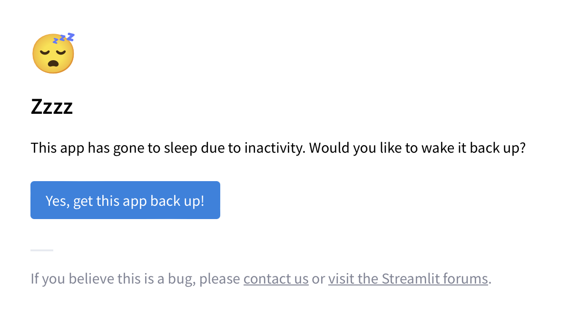
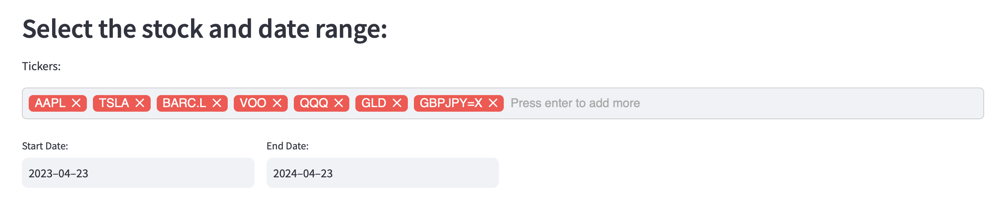
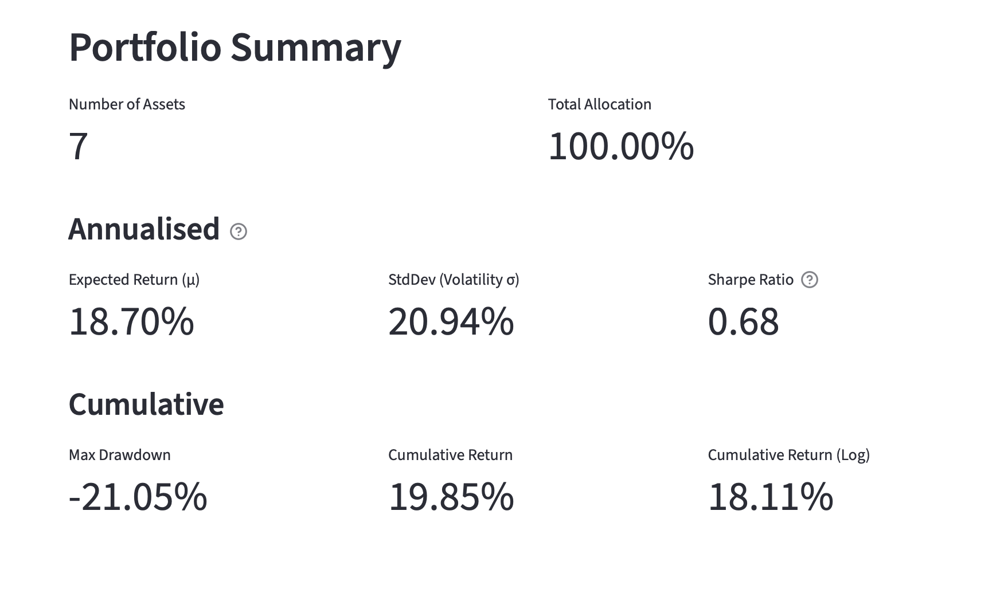
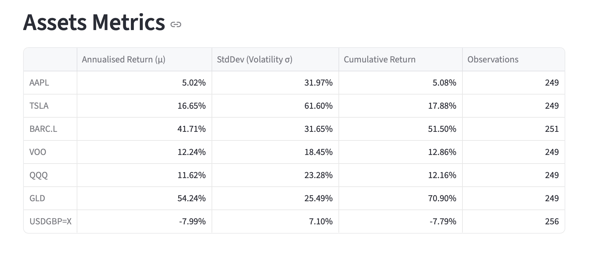
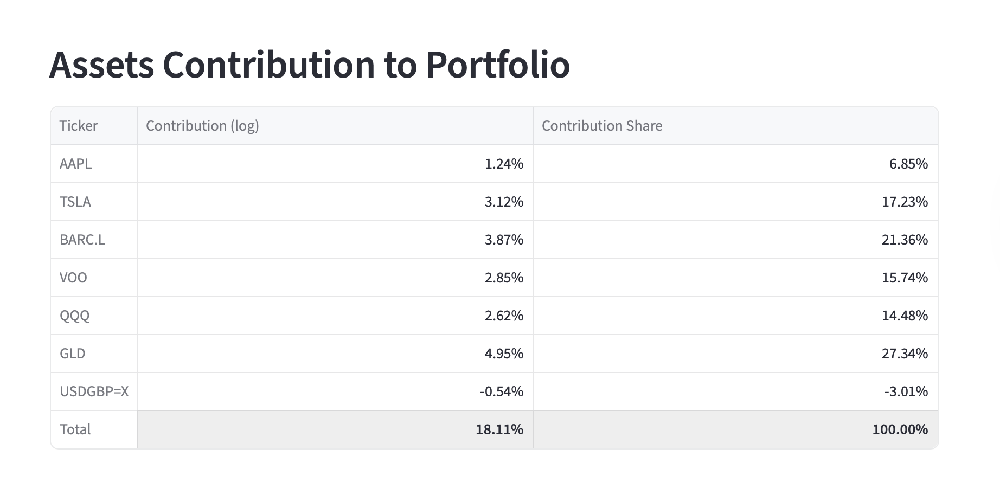
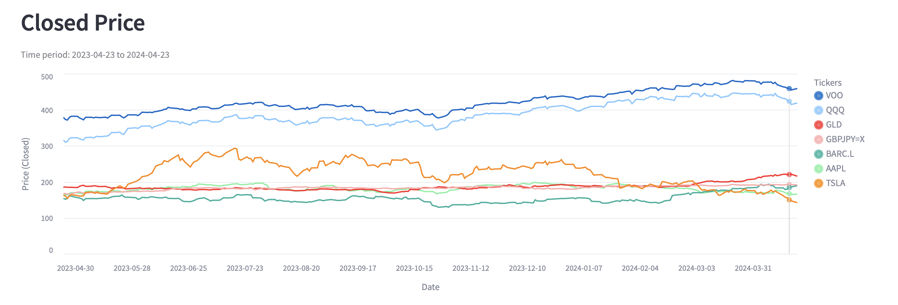
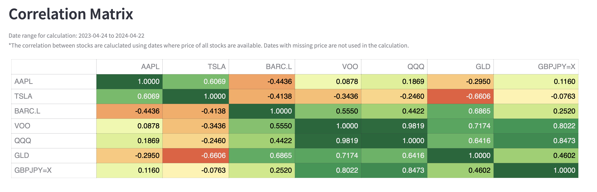
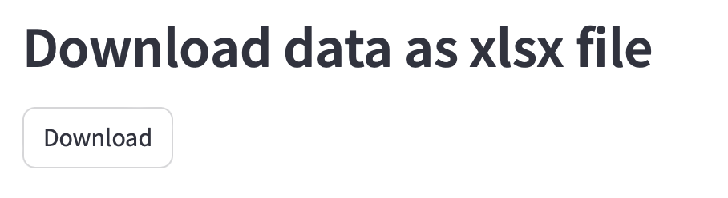

# Portfolio Correlation Calculator V2

A Streamlit web app for analyzing portfolio performance, asset behavior, and cross-asset correlation using Yahoo Finance data.

Hosted app:
- https://stock-correlation-matrix.streamlit.app

---

## Overview

This app helps you move from a simple ticker list to a portfolio-level view of:
- Risk and return metrics
- Asset-level performance
- Correlation structure
- Contribution by asset
- Downloadable reporting in Excel

It is designed for quick exploratory analysis with editable portfolio inputs and immediate visual and metric feedback.

---

## Key Features

- Editable portfolio table (`Tickers`, `Allocation Percentage`)
- Date-range based analysis
- Portfolio summary metrics:
  - Expected Return (annualized)
  - Volatility / StdDev (annualized)
  - Sharpe Ratio
  - Max Drawdown
  - Cumulative Return
- Asset-level metrics:
  - Annualized Return
  - Volatility
  - Cumulative Return
  - Observations
- Asset contribution table:
  - Contribution (log)
  - Contribution Share
- Correlation matrix with styled heatmap
- Price visualization modes:
  - Raw price
  - Indexed to 100 (first valid date per asset)
- One-click Excel export with multiple analysis sheets

---

## How to Use

1. Set `Start Date` and `End Date`.
2. Edit the portfolio table:
   - Add or remove tickers
   - Adjust allocation percentages
3. Click `Calculate`.
4. Review:
   - Portfolio Summary
   - Asset Metrics
   - Asset Contribution
   - Correlation Matrix
   - Price chart and data table (`Price` vs `Indexed`)
5. Download the full `.xlsx` report.

---

## Screenshots

If the hosted app is sleeping, click the blue reactivation button:



Portfolio input section:



Portfolio summary and contribution views:

<!-- TODO: Replace with an up-to-date screenshot from current V2 app -->




Price chart and correlation output examples:




Price view toggle (`Price` vs `Indexed`) and data table:

<!-- TODO: Replace with an up-to-date screenshot from current V2 app -->


Download section:



---

## Technical Overview

### Entry Point
- `main.py`
  Streamlit app orchestration: UI, validation, calculations, rendering, and export.

### Core Modules (`app_lib/`)
- `stock_api.py`
  Fetches closing price history from Yahoo Finance.
- `data_transform.py`
  Log-return calculation and price normalization (`base=100`).
- `metrics.py`
  Asset and portfolio metrics.
- `corr_matrix.py`
  Correlation matrix computation with minimum-data guardrails.
- `heatmap.py`
  Styled correlation table.
- `line_chart.py`
  Altair line chart for price and index views.
- `xlsx_summary_report.py`
  Multi-sheet Excel export builder.
- `streamlit_helper.py`
  Streamlit display helpers (for example, total-row highlighting).

### Tests
- `tests/test_stock_api.py`
- `tests/test_data_transform.py`
- `tests/test_metrics.py`
- `tests/test_corr_matrix.py`
- `tests/test_heatmap.py`

---

## Local Setup

Install dependencies:

```bash
pip install -r requirements.txt
```

Run app:

```bash
streamlit run main.py
```

Run tests:

```bash
pytest
```

---

## Data and Calculation Notes

- Data source: Yahoo Finance (`yfinance`)
- Returns used for analytics: daily log returns
  - `log_return = ln(P_t) - ln(P_(t-1))`
- Log return calculation rejects non-positive prices.
- Portfolio calculations use allocation weights normalized across valid assets.
- Correlation requires sufficient overlapping valid observations.

---

## Input Validation Rules

The app blocks analysis and shows errors when:
- Portfolio is empty
- Any ticker is blank
- Duplicate tickers exist
- Allocation contains negative values
- Total allocation exceeds 100%
- Date range is invalid (`start >= end`)
- Price data is unavailable for selected assets and date range

---

## Excel Export Contents

The download includes these sheets:
- `parameters`
- `portfolio_allocation`
- `portfo_summary`
- `asset_metric`
- `asset_contrib`
- `price_history`
- `price_history_indexed`
- `correlation_matrix`

---

## Project History

This project began as a CS50P final project focused on stock correlation and evolved into a modular portfolio analytics app (V2) with broader metrics, validation, and richer export and reporting.
